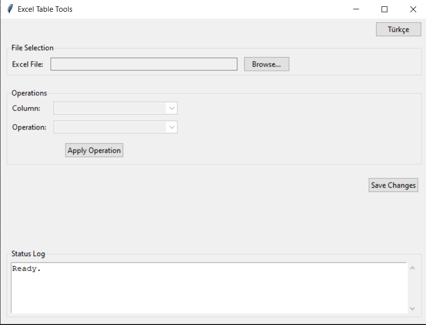
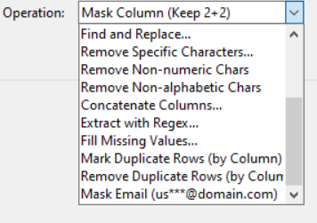
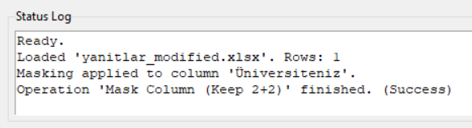
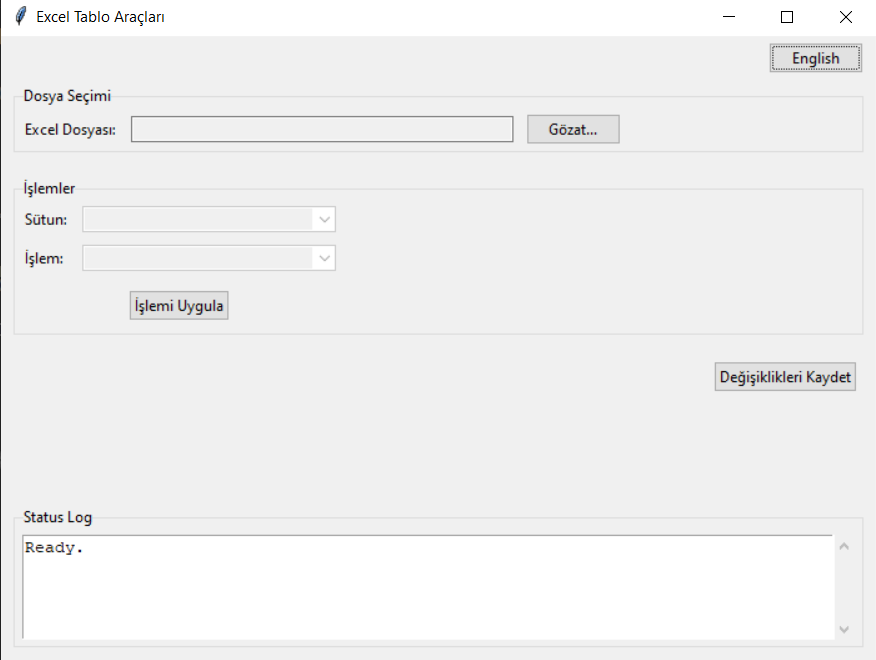

# Excel Table Tools

A simple GUI application built with Python and Tkinter to perform common data cleaning and manipulation operations on Excel files.

## Screenshots

*English main application window*



*Example: Column selection and operations*


*Example: Operation selection*



*Status Log*



*Turkish main application window*




## Features

*   Load files (`.xlsx`, `.xls`, `.csv`).
*   Perform various operations on selected columns:
    *   Mask data (keep first 2 and last 2 characters).
    *   Mask email addresses (e.g., `us***@domain.com`).
    *   Trim leading/trailing whitespace.
    *   Split columns by delimiter (space, colon).
    *   Split surname (last word) into a new column.
    *   Change text case (UPPERCASE, lowercase, Title Case).
    *   Find and replace text.
    *   Remove specific characters.
    *   Remove non-numeric or non-alphabetic characters.
    *   Concatenate multiple columns into a new column.
    *   Extract data using regular expressions into a new column.
    *   Fill missing values (NaN, empty strings) with a specified value.
    *   Mark duplicate rows based on a column.
    *   Remove duplicate rows based on a column.
*   **Refresh**: Resets the application to its initial state, clearing loaded data and history.
*   Save the modified data to a new file (`.xlsx`, `.xls`, `.csv`).
*   Basic status logging.
*   Switchable UI language (English/Turkish).
*   Preview functionality to see the effect of operations before applying.
*   Undo/Redo functionality for most operations.

## Requirements

*   Python 3.x
*   pandas
*   openpyxl

You can install the required libraries using pip:
```bash
pip install -r requirements.txt
```

## Usage
1. Install requirements:
   ```bash
   pip install -r requirements.txt
   ```
3.  Run the `main.py` script:
    ```bash
    python main.py
    ```
4.  Click "Browse..." to load an Excel file.
5.  Select the target column from the dropdown list.
6.  Select the desired operation from the dropdown list.
7.  Click "Apply Operation". Some operations might prompt for additional input (e.g., find/replace text, new column names).
8.  Repeat steps 5-7 for other operations as needed.
9.  Click "Save Changes" to save the modified data to a new Excel file.


12312312123
