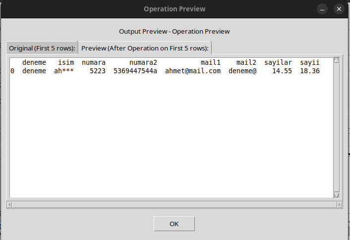

# Excel Table Tools

A simple GUI application built with Python and Tkinter to perform common data cleaning and manipulation operations on Excel files, CSV files, and other tabular data formats.

## Screenshots


 

 


## Features

*   **Load and save multiple file formats**:
    *   Load Excel files (`.xlsx`, `.xls`) and CSV files (`.csv`).
    *   Save to various formats: Excel (`.xlsx`, `.xls`), CSV (`.csv`), JSON (`.json`), HTML (`.html`), and Markdown (`.md`).
*   **Perform various operations on selected columns**:
    *   **Data masking**:
        *   Mask data (keep first 2 and last 2 characters)
        *   Mask email addresses (e.g., `us***@domain.com`)
        *   Mask words (Keep 2 letters per word)
    *   **Text cleaning**:
        *   Trim leading/trailing whitespace
        *   Change text case (UPPERCASE, lowercase, Title Case)
        *   Find and replace text
        *   Remove specific characters
        *   Remove non-numeric or non-alphabetic characters
    *   **Column operations**:
        *   Split columns by delimiter (space, colon)
        *   Split surname (last word) into a new column
        *   Concatenate the selected column with additional columns into a new column
        *   Merge columns with customizable handling of missing values (fills NaN/null values before merging)
        *   Rename columns
        *   Round Numbers to a specified number of decimal places
        *   Calculate Column by Constant (+, -, \*, /)
        *   Create Calculated Column (from 2 columns using +, -, \*, /)
    *   **Data validation**:
        *   Validate Email Addresses
        *   Validate Phone Numbers
        *   Validate Date Format
        *   Validate Numeric Values
        *   Validate Alphanumeric Text
        *   Validate URL Addresses
    *   **Data extraction and transformation**:
        *   Extract data using regular expressions into a new column
        *   Fill missing values (NaN, empty strings) with a specified value
    *   **Row operations**:
        *   Mark duplicate rows based on a column
        *   Remove duplicate rows based on a column
*   **Interactive workflow**:
    *   **Preview** operations before applying them to see the effect on your data
        *   Invalid cells are highlighted in red in preview and saved output files for easy identification.
    *   **Undo/Redo** functionality for all operations
    *   **Refresh** option to reset the application to its initial state
*   **User interface features**:
    *   Status log to track operations and changes
    *   Multilingual interface (English, Turkish, and Russian)
    *   Intuitive user interface with descriptive operation names

## Project Structure

The project is organized with the following directory structure:

```
ExcelTableTools/
├── excel_table_tools.py        # Main launcher script
├── README.md                   # Project documentation
├── requirements.txt            # Python dependencies
├── run_excel_tools.bat         # Windows script to run the tool
├── run_excel_tools.sh          # Linux script to run the tool
├── run_excel_tools_macos.sh    # macOS script to run the tool (created by build_macos.sh)
├── src/                        # Source code
│   ├── main.py                 # Main application logic
│   ├── translations.py         # Language translations
│   ├── operations/             # Data manipulation operations
│   │   ├── __init__.py         # Initialization for operations module
│   │   ├── case_change.py      # Change text case operations
│   │   ├── concatenate.py      # Concatenate columns
│   │   ├── duplicates.py       # Handle duplicate rows
│   │   ├── extract_pattern.py  # Extract data using regex
│   │   ├── fill_missing.py     # Fill missing values
│   │   ├── find_replace.py     # Find and replace text
│   │   ├── masking.py          # Mask sensitive data
│   │   ├── merge_columns.py    # Merge multiple columns
│   │   ├── numeric_operations.py # Perform numeric calculations
│   │   ├── preview_utils.py    # Utilities for previewing data
│   │   ├── remove_chars.py     # Remove specific characters
│   │   ├── rename_column.py    # Rename columns
│   │   ├── splitting.py        # Split columns
│   │   ├── trimming.py         # Trim whitespace
│   │   └── validate_inputs.py  # Validate input data
│   └── utils/                  # Utility functions
├── resources/                  # Configuration and assets
│   ├── operations_config.json  # Operations configuration
│   ├── last_language.txt       # Language preference
│   ├── last_directory.txt      # Last accessed directory
│   └── media/                  # Screenshots and images
│       ├── 1.png
│       ├── 2.png
│       ├── 3.png
│       ├── 4.png
│       └── 5.png
│
├── media/                      # Additional media files
│   ├── v1/                     # Version 1 screenshots
│   │   ├── 1.png
│   │   ├── 2.png
│   │   ├── 3.png
│   │   ├── 4.png
│   │   └── 5.png
│   └── v2/                     # Version 2 screenshots
│       ├── main screen.png
│       ├── preview.png
│       ├── russian page.png
│       ├── success alert.png
│       └── turkish page.png
└── GenerateExecutable/         # Build scripts and executables
    ├── build_linux.sh          # Linux executable builder
    ├── build_macos.sh          # macOS executable builder
    ├── build_windows.bat       # Windows executable builder
    ├── linux/                  # Output directory for Linux executable
    ├── macos/                  # Output directory for macOS executable
    └── windows/                # Output directory for Windows executable
```

## Requirements

*   Python 3.x
*   pandas
*   openpyxl
*   tkinter
*   tabulate (for Markdown export)
*   jinja2 (for styled output)
*   python-dateutil (for validating date formats)

You can install the required libraries using pip:
```bash
pip install -r requirements.txt
```

## Usage
1. Install requirements:
   ```bash
   pip install -r requirements.txt
   ```
2. Run the appropriate launcher script from the project root after building the executable (see 'Creating an Executable' section), or run the Python script directly:
   ```bash
   python excel_table_tools.py
   ```
3. Click "Browse..." to load an Excel (xlsx, xls) or CSV file.
4. Select the target column from the dropdown list.
5. Select the desired operation from the dropdown list.
6. (Optional) Click "Preview" to see the effect of the operation before applying it.
7. Click "Apply Operation". Some operations might prompt for additional input (e.g., find/replace text, new column names).
8. Repeat steps 4-7 for other operations as needed.
9. Use the "Undo" or "Redo" buttons if needed to revert or reapply operations.
10. Select the desired output format from the dropdown menu next to the Save button.
11. Click "Save Changes" to save the modified data to a new file in the selected format.

## Creating an Executable

Scripts are included to build a standalone executable using PyInstaller for Linux, macOS, and Windows:

### Linux
```bash
chmod +x GenerateExecutable/build_linux.sh
./GenerateExecutable/build_linux.sh
```
The executable will be created in the `GenerateExecutable/linux/` directory.
A launcher script `run_excel_tools.sh` will be created in the project root.

### macOS
```bash
chmod +x GenerateExecutable/build_macos.sh
./GenerateExecutable/build_macos.sh
```
The executable will be created in the `GenerateExecutable/macos/` directory.
A launcher script `run_excel_tools_macos.sh` will be created in the project root.

### Windows
```bash
GenerateExecutable\build_windows.bat
```
The executable will be created in the `GenerateExecutable\windows\` directory.
A launcher script `run_excel_tools.bat` will be created in the project root.